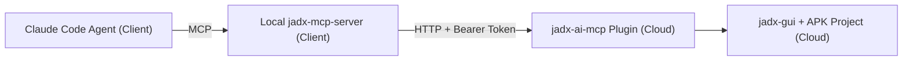

# JADX 云端 + 本地 MCP 工作流（按真实使用场景）

本仓库包含两个项目：

- `jadx-ai-mcp/`：运行在云端 `jadx-gui` 内的插件（Java）
- `jadx-mcp-server/`：运行在客户端本机的 MCP Server（Python）

你描述的真实链路是：

1. 客户端运行 Claude Code Agent，连接本地 MCP Server  
2. 云端通过命令行安装 `jadx-ai-mcp` 插件并开放端口  
3. 客户端本地 MCP Server 连接云端插件  
4. Agent 通过本地 MCP 调用 JADX 能力

---

## 1. 架构图（对应真实工作流）



推荐网络方式（只有 IP、无固定域名时）：

- 优先：`SSH Tunnel + Token`
- 备选：直接 `http://<cloud-ip>:<port> + Token`（不推荐公网裸露）

---

## 2. 一次性前置条件

云端：

- Java 11+
- `jadx` / `jadx-gui` 命令可用
- 可打开 GUI；无桌面可用 `xvfb-run` 或纯 CLI launcher

客户端：

- Python 3.10+
- `uv` 可用
- Claude Code 可配置本地 MCP

---

## 3. 步骤一：云端安装 `jadx-ai-mcp` 插件（命令行）

### 方式 A：安装发布版（推荐，最快）

```bash
jadx plugins --install "github:zinja-coder:jadx-ai-mcp"
```

说明：

- 这是从 GitHub 发布产物安装，不是本地编译产物。
- 安装后重启 `jadx-gui` 生效。

### 方式 B：安装你本地构建的 jar

在仓库构建：

```bash
cd /Users/dsk/Dev/AI_era_2026/jadx_enhancement/jadx-ai-mcp
mvn -DskipTests package
```

安装构建产物：

```bash
JAR_PATH=$(ls -t target/*.jar | head -n 1)
jadx plugins --install-jar "$JAR_PATH"
```

---

## 4. 步骤二：云端启动插件并拿到 token

先设置（无 GUI 菜单操作场景）：

```bash
export JADX_AI_MCP_HOST=127.0.0.1
export JADX_AI_MCP_PORT=8650
export JADX_AI_MCP_REMOTE_MODE=true
```

方式 A（有桌面会话）：

```bash
jadx-gui /path/to/app.apk
```

方式 B（Linux 无桌面）：

```bash
xvfb-run -a jadx-gui /path/to/app.apk
```

方式 C（纯 CLI 常驻，不依赖桌面）：

```bash
java -cp "<path-to-jadx>/lib/jadx-dev-all.jar:/path/to/jadx-ai-mcp.jar" \
  com.zin.jadxaimcp.cli.HeadlessServerLauncher \
  --port 8650 \
  --remote-mode true \
  /path/to/app.apk
```

日志中会打印一次性 token（仅显示一次），形如：

```text
One-time token (shown once): <TOKEN>
Use Authorization header: Bearer <TOKEN>
```

注意：

- `JADX_AI_MCP_REMOTE_MODE` 默认就是 `true`
- 默认监听：`127.0.0.1:8650`
- `jadx`/`jadx-cli` 标准入口会在任务后强制退出，不适合做长期 MCP 服务；无桌面场景建议用上面的 `HeadlessServerLauncher`

---

## 5. 步骤三：客户端本地 MCP Server 连接云端插件

进入本地 MCP 项目：

```bash
cd /Users/dsk/Dev/AI_era_2026/jadx_enhancement/jadx-mcp-server
```

### 方案 A（推荐）：SSH 隧道（只有 IP 无域名时首选）

先开隧道：

```bash
ssh -N -L 8650:127.0.0.1:8650 user@<cloud-ip>
```

再启动本地 MCP Server（指向本地转发端口）：

```bash
uv run jadx_mcp_server.py --jadx-url http://127.0.0.1:8650 --token <ONE_TIME_TOKEN>
```

### 方案 B：直接连云端 IP 端口（不推荐公网）

```bash
uv run jadx_mcp_server.py --jadx-url http://<cloud-ip>:8650 --token <ONE_TIME_TOKEN>
```

也可用环境变量传 token：

```bash
export JADX_AUTH_TOKEN=<ONE_TIME_TOKEN>
uv run jadx_mcp_server.py --jadx-url http://127.0.0.1:8650
```

---

## 6. 步骤四：Claude Code Agent 连接本地 MCP Server

在 Claude Code 的 MCP 配置中添加一个 server，核心是启动命令：

```json
{
  "mcpServers": {
    "jadx-mcp-server": {
      "command": "uv",
      "args": [
        "--directory",
        "/Users/dsk/Dev/AI_era_2026/jadx_enhancement/jadx-mcp-server",
        "run",
        "jadx_mcp_server.py",
        "--jadx-url",
        "http://127.0.0.1:8650",
        "--token",
        "<ONE_TIME_TOKEN>"
      ]
    }
  }
}
```

说明：

- 如果使用 SSH 隧道，`--jadx-url` 保持 `http://127.0.0.1:8650`
- 如果直连云端 IP，改为 `http://<cloud-ip>:8650`

---

## 7. 快速验收（4 个检查点）

1. 云端 `jadx-gui` 已打开 APK，插件已启动  
2. 云端日志里拿到 token  
3. 本地 `jadx_mcp_server.py` 进程正常运行  
4. Claude Code 能看到并调用 JADX 相关 MCP tools

可用一句测试：

- `List all available JADX MCP tools`

---

## 8. 常见故障

`401 Unauthorized`

- token 输入错误
- token 过期（重新启动插件或旋转 token）
- 本地 MCP 启动时未传 `--token` 且未设置 `JADX_AUTH_TOKEN`

`Connection refused / timeout`

- 云端插件未启动
- 端口不一致
- SSH 隧道未建立或已断开
- 云端安全组/防火墙未放行（直连场景）

看不到工具

- Claude Code MCP 配置未生效
- 本地 MCP Server 没有真正启动成功

---

## 9. 相关文档

- 插件编译排查：`/Users/dsk/Dev/AI_era_2026/jadx_enhancement/jadx-ai-mcp/BUILD_TROUBLESHOOTING.md`
- 插件项目：`/Users/dsk/Dev/AI_era_2026/jadx_enhancement/jadx-ai-mcp`
- 本地 MCP 项目：`/Users/dsk/Dev/AI_era_2026/jadx_enhancement/jadx-mcp-server`
