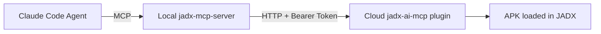

# JADX Cloud + Local MCP 工作流

这个仓库是一个 **组合工程**，包含两个子项目：

- `jadx-ai-mcp/`：云端 JADX 插件（Java）
- `jadx-mcp-server/`：本地 MCP 桥接服务（Python）

## 文档分工（避免重复）

- 本 README：
  - 只讲端到端工作流
  - 只讲跨项目决策（端口、隧道、token、MCP scope）
- `jadx-ai-mcp/README.md`：
  - 只讲云端插件如何构建、安装、启动（GUI / headless）
  - 只讲插件端能力边界（headless 支持/不支持）
- `jadx-mcp-server/README.md`：
  - 只讲本地 MCP 如何连接云端插件
  - 只讲 Claude Code MCP 配置与冲突处理

## 真实工作流



## 快速开始（最短路径）

### 1) 云端安装插件

```bash
jadx plugins --install "github:zinja-coder:jadx-ai-mcp"
```

如果需要本地构建版，见：`jadx-ai-mcp/README.md`。

### 2) 云端启动插件（推荐 headless 常驻）

```bash
export JADX_AI_MCP_HOST=127.0.0.1
export JADX_AI_MCP_PORT=8650
export JADX_AI_MCP_REMOTE_MODE=true
```

无桌面环境时，使用 headless launcher：

```bash
java -cp "<jadx-all-jar>:<jadx-ai-mcp-jar>" \
  com.zin.jadxaimcp.cli.HeadlessServerLauncher \
  --port 8650 \
  --remote-mode true \
  /path/to/app.apk
```

日志会输出一次性 token：

```text
One-time token (shown once): <TOKEN>
Use Authorization header: Bearer <TOKEN>
```

### 3) 客户端建立隧道（推荐）

```bash
ssh -f -N -L 18650:127.0.0.1:8650 user@<cloud-ip>
```

说明：

- `-N` 只做端口转发
- 不加 `-f` 时会前台阻塞，这是正常现象
- 使用 `18650` 避免和本地已有 `8650` 冲突

### 4) 本地启动 MCP server

```bash
uv run jadx_mcp_server.py \
  --jadx-url http://127.0.0.1:18650 \
  --token-file ~/.secrets/jadx_cloud.token
```

> 建议用 `--token-file`，避免把 token 写进全局环境变量影响其他会话。

---

## 已验证的关键结论

- `jadx` / `jadx-cli` 标准入口会退出，不适合做常驻 MCP 后端。
- 无桌面云机（含 macOS 无 GUI 会话）推荐 `HeadlessServerLauncher`。
- 开启 remote mode 后，`/health` 也需要 Bearer token。
- headless 下可做“按类/方法/资源查询”，但不支持“当前 GUI 选中类/文本”、重命名、debugger。

---

## 常见问题（本次排障沉淀）

### Q1. `ssh -N -L ...` 执行后终端像卡住

正常。它在前台保活隧道。要后台运行请加 `-f`。

### Q2. `/health` 出现 Unauthorized

remote mode 开启时必须带 token。否则返回 401。

### Q3. `jadx-gui` 在无桌面环境报 `HeadlessException`

这是预期限制。请改用：

- Linux：`xvfb-run -a jadx-gui ...`（若仍需要 GUI）
- 通用：`HeadlessServerLauncher`（推荐）

### Q4. Claude `/mcp` 显示 `No MCP servers configured`

常见原因是 **MCP 注册在其他项目 scope**。在当前项目目录执行：

```bash
claude mcp add -s local jadx-cloud -- uv --directory /path/to/jadx-mcp-server run jadx_mcp_server.py --jadx-url http://127.0.0.1:18650 --token-file ~/.secrets/jadx_cloud.token
```

再执行：

```bash
claude mcp list
```

### Q5. 我已经配置了但 `/mcp` 还是看不到

优先检查：

- 当前工作目录是否正确
- `claude mcp list` 在该目录是否能看到 server
- 是否存在旧 server 名称（如 `jadx-mcp`）冲突
- 是否需要重启 Claude Code 刷新会话缓存

---

## 详细文档入口

- 云端插件：`jadx-ai-mcp/README.md`
- 本地桥接：`jadx-mcp-server/README.md`
- 插件构建排障：`jadx-ai-mcp/BUILD_TROUBLESHOOTING.md`
